# 🎯 Typo Payments - Security Vulnerability Demo

A **deliberately vulnerable** web application for demonstrating multiple security vulnerabilities. This application simulates a fictional payment processing company called "Typo Payments".

> [!NOTE] **Remember**: 
> Never use these techniques maliciously. Understanding vulnerabilities helps build more secure applications! 


## 🚀 Quick Start

### Docker

**Prerequisites**: Docker and Docker Compose installed

```bash
# Start everything
docker compose up --build -d

# Stop everything
docker compose down -v
```

If any point you need to start again:
```bash
docker compose down -v && docker compose up --build -d
```

## ⚙️ Configuration
### Endpoints
- Application: **http://localhost:5000** 
- Postgres Admin: **http://localhost:8080**

### Accounts

#### Web Application:

| Username | Password | 
| --- | --- |
| `alice` | `Welcome123!` |
| `bob` | `Summer2023!` |
| `admin` | `P@$$w0rd` |

#### Database:
| Username | Password | 
| --- | --- |
| `admin` | `password123` |

## 🏗️ Infrastructure Architecture

```mermaid
graph TB
    subgraph "Docker Network: typo-network"
        web["🌐 Web Application<br/>(typo-web)<br/>Port: 5000"]
        postgres["🗄️ PostgreSQL Database<br/>(typo-db)<br/>Port: 5432"]
        pgadmin["🔧 pgAdmin<br/>(typo-pgadmin)<br/>Port: 8080"]
        attacker["👤 Attacker Machine<br/>(typo-attacker)<br/>Alpine Linux"]
        
        web -->|"Connects to"| postgres
        pgadmin -->|"Manages"| postgres
        attacker -.->|"Network Access"| web
        attacker -.->|"Network Access"| postgres
    end
    
    style web fill:#4CAF50
    style postgres fill:#336791
    style pgadmin fill:#1976D2
    style attacker fill:#FF5722
```



## 📋 Exploit Instructions

> [!INFO] See [EXPLOIT_REFERENCE.md](/docs/EXPOIT_REFERENCE.md) for full instructions on how to exploit the application

### 🔥 Quick SQL Injection Test

1. Login as Alice
2. Go to Status page
3. Try: `' OR 1=1 --` (see all payments from all users)