# 🎯 Typo Payments - Security Vulnerability Demo

A **deliberately vulnerable** web application for demonstrating multiple security vulnerabilities. This application simulates a fictional payment processing company called "Typo Payments".

> [!NOTE] 
> **Remember**: 
> Never use these techniques maliciously. Understanding vulnerabilities helps build more secure applications! 


## 🚀 Quick Start

### Docker

**Prerequisites**: Docker and Docker Compose installed

```bash
# Start everything
docker compose up --build -d

# Stop everything
docker compose down -v
```

If any point you need to start again:
```bash
docker compose down -v && docker compose up --build -d
```

## ⚙️ Configuration
### Endpoints
- Application: **http://localhost:5000** 
- Postgres Admin: **http://localhost:8080**

### Accounts

#### Web Application:

| Username | Password | 
| --- | --- |
| `alice` | `Welcome123!` |
| `bob` | `Summer2023!` |
| `admin` | `P@$$w0rd` |

#### Database:
| Username | Password | 
| --- | --- |
| `admin` | `password123` |

### Architecture

```mermaid
graph TB
    subgraph "Docker Network: typo-network"
        web["🌐 Web Application<br/>(typo-web)<br/>Port: 5000"]
        postgres["🗄️ PostgreSQL Database<br/>(typo-db)<br/>Port: 5432"]
        pgadmin["🔧 pgAdmin<br/>(typo-pgadmin)<br/>Port: 8080"]
        attacker["👤 Attacker Machine<br/>(typo-attacker)<br/>Alpine Linux"]
        
        web -->|"Connects to"| postgres
        pgadmin -->|"Manages"| postgres
        attacker -.->|"HTTP"| web
        postgres -.->|"Reverse Shell"| attacker 
    end
    
    
    style web fill:#A8E6CF,stroke:#333,stroke-width:2px
    style postgres fill:#B4C7E7,stroke:#333,stroke-width:2px
    style pgadmin fill:#FFD3B6,stroke:#333,stroke-width:2px
    style attacker fill:#FFAAA5,stroke:#333,stroke-width:2px
```



## 🎓 Learning Path

Follow the tutorials in order (1 → 2 → 3) to build a solid foundation.

Focus on understanding the vulnerability patterns in each tutorial to learn what to avoid in your own applications.

---

## 📋 Tutorial Index

This repository includes comprehensive tutorials for learning SQL injection techniques:

> [!WARNING]
> **Educational Use Only:** These tutorials are designed for authorized security testing and educational purposes only. Never use these techniques against systems you don't own or have explicit permission to test.

> [!TIP]
> **Use the "View SQL Query" feature** on the search page to see how your injected input affects the actual SQL query being executed.

### [1. Introduction to SQL Injection](./docs/1.%20INTRO%20TO%20SQL%20INJECTION.MD)

**Difficulty:** Beginner  
**Target:** Search page (`/search`)  
**Time:** 30-45 minutes

Learn the fundamentals of SQL injection through UNION-based attacks:
- Identifying SQL injection vulnerabilities
- Understanding UNION SELECT mechanics
- Determining column counts with ORDER BY
- Extracting database schema information
- Retrieving sensitive data (PII, credit cards)
- Gathering system information
- Reading server files and directories

**Key Techniques:**
- Error-based detection
- UNION SELECT queries
- Information schema enumeration
- PostgreSQL administrative functions

---

### [2. Blind SQL Injection](./docs/2.%20BLIND%20SQL%20INJECTION.md)

**Difficulty:** Intermediate  
**Target:** Status page (`/status`)  
**Time:** 20-30 minutes

Master boolean-based blind SQL injection when direct output isn't available:
- Understanding TRUE/FALSE conditional logic
- Character-by-character data extraction
- Using SUBSTRING for precise data retrieval
- Automating extraction with Python scripts
- Cracking password hashes
- Privilege escalation through credential theft

**Key Techniques:**
- Boolean-based blind injection
- SUBSTRING enumeration
- Automated exploitation scripts
- Rainbow table hash cracking

---

### [3. Advanced Techniques](./docs/3.%20ADVANCED%20TECHNIQUES.md)

**Difficulty:** Advanced  
**Target:** Search page (`/search`)  
**Time:** 15-20 minutes

Escalate from database access to full system compromise:
- Dumping environment variables and server configuration
- Executing commands with COPY TO PROGRAM
- Establishing reverse shell connections
- Gaining remote code execution
- Complete server takeover

**Key Techniques:**
- COPY TO PROGRAM exploitation
- Reverse shell payloads
- Remote command execution
- Post-exploitation activities
